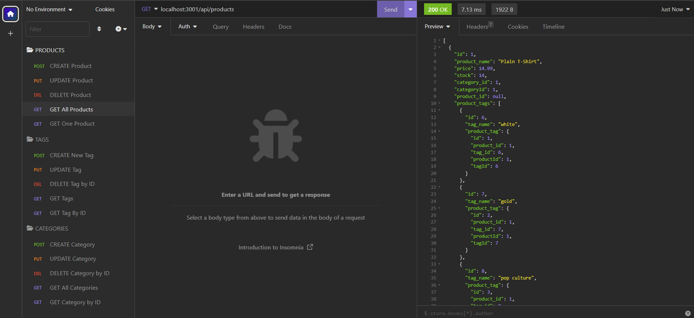
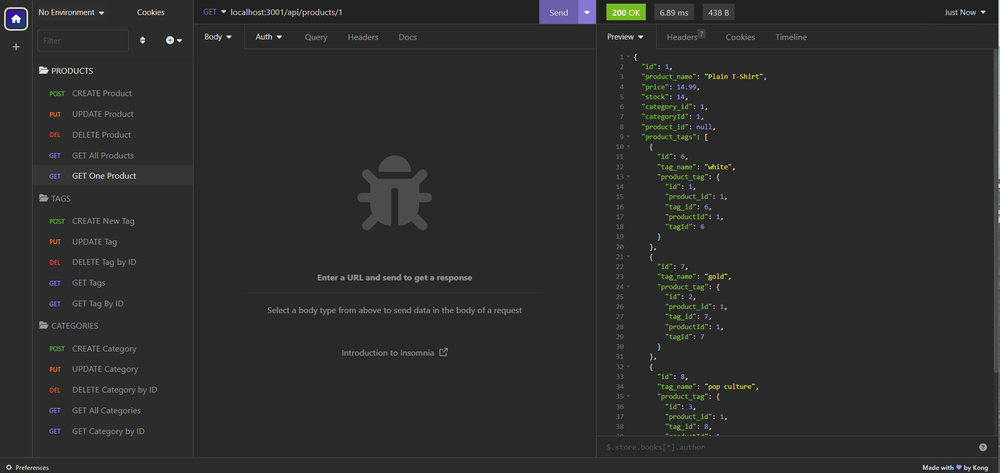
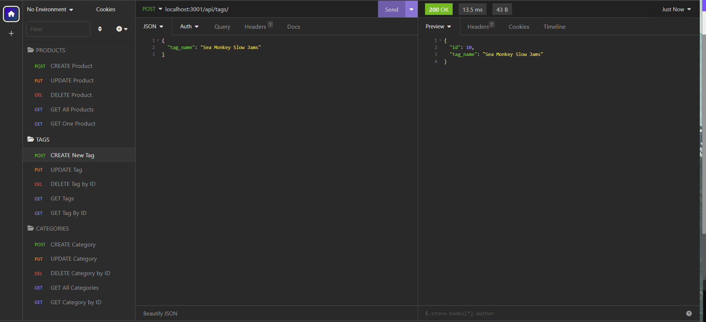
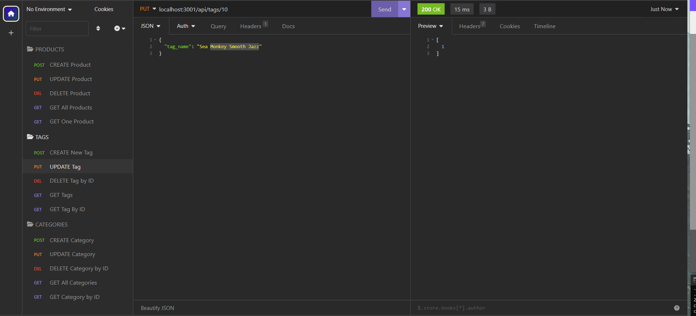
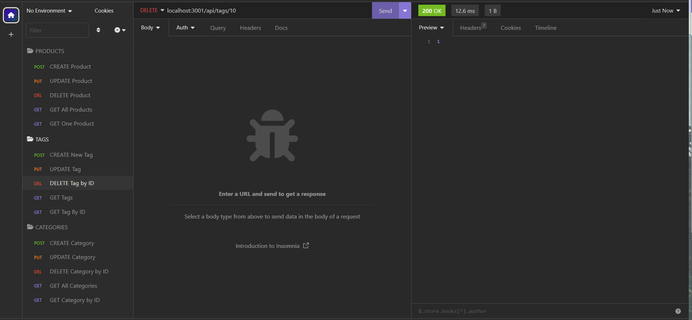

# give-me-your-money-honey
  [](https://opensource.org/licenses/MIT)


  A digital traveling merchant that opens his coat do display a collection of items available for purchase to the weary e-traveler.
  ## Table of Contents:
  * [Installation](#installation)
  * [Usage](#usage)
  * [License](#license)
  * [Contributing](#contributing)
  * [Tests](#tests)
  * [Questions](#questions)
  ## Installation:
  To install the dependencies needed, open the console and run:
  * npm i

  Also, mysql must be initialized. After opening mysql and logging in with integrated terminal run: 
  * source schema.sql

  To seed the file, quit mysql, then in terminal run:
  * npm run seed
  
  ## Usage:
  In integrated terminal, start the app by running:
  * npm start

  Follow the routes for what to type in for GET, PUT, DELETE, POST requests, and refer to what is returned for a GET request of ALL items from specific endpoint as to what you are able to send in or update on your POST/PUT requests. There is a screen recording of some basic usage of the app.

  https://drive.google.com/file/d/1A6wD2ymGk9iVaGd0O2r_U_nP_fzgCA_o/view

  ```md
  WHEN I open API GET routes in Insomnia for categories, products, or tags
  THEN the data for each of these routes is displayed in a formatted JSON
  ```
  
  
  
  ```md
  WHEN I test API POST, PUT, and DELETE routes in Insomnia
  THEN I am able to successfully create, update, and delete data in my database
  ```
  
  
  

  ## License:
  The MIT License (MIT)

      Copyright (c) undefined undefined
      
      Permission is hereby granted, free of charge, to any person obtaining a copy of this software and associated documentation files (the "Software"), to deal in the Software without restriction, including without limitation the rights to use, copy, modify, merge, publish, distribute, sublicense, and/or sell copies of the Software, and to permit persons to whom the Software is furnished to do so, subject to the following conditions:
      
      The above copyright notice and this permission notice shall be included in all copies or substantial portions of the Software.
      
      THE SOFTWARE IS PROVIDED "AS IS", WITHOUT WARRANTY OF ANY KIND, EXPRESS OR IMPLIED, INCLUDING BUT NOT LIMITED TO THE WARRANTIES OF MERCHANTABILITY, FITNESS FOR A PARTICULAR PURPOSE AND NONINFRINGEMENT. IN NO EVENT SHALL THE AUTHORS OR COPYRIGHT HOLDERS BE LIABLE FOR ANY CLAIM, DAMAGES OR OTHER LIABILITY, WHETHER IN AN ACTION OF CONTRACT, TORT OR OTHERWISE, ARISING FROM, OUT OF OR IN CONNECTION WITH THE SOFTWARE OR THE USE OR OTHER DEALINGS IN THE SOFTWARE.
  ## Contributing:
  N/A
  ## Tests:
  N/A
  ## Questions:
  If you have questions, you may contact me on [GitHub](https://github.com/d-lil) or you may reach out by contacting Daniel Liljegren at dahneel@gmail.com
